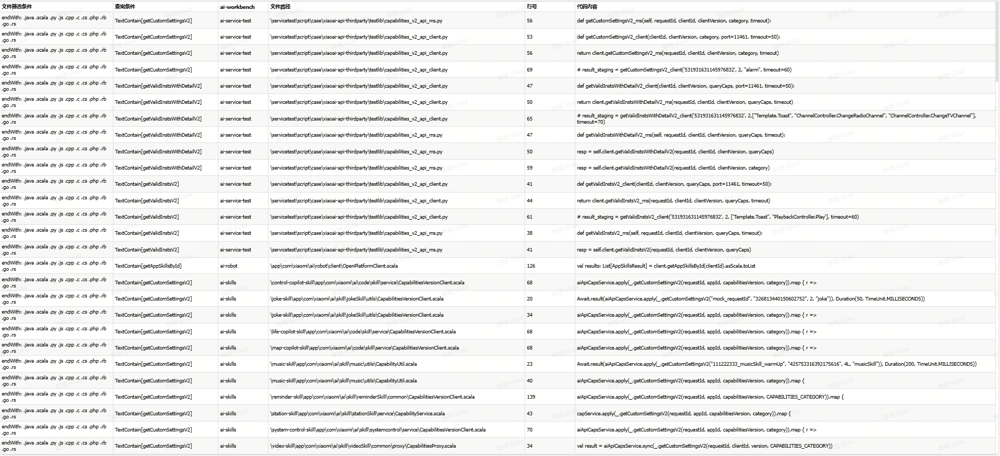

# 工程背景

提供一个工具可以扫描gitlab仓库代码的工具。

# 快速开始
service-aggregate/src/main/resources/config.yml 当中可以配置账号、git group信息（ai-service）、白名单（跳过某个项目比如ai-open-platform）

可以根据查询条件构造对应的文件的query，例如:

"包含cluster_01或者cluster_01_with_password或者RedisConfig() 但不包含 cluster_01_proxy 的 行，结果
输出到CSV文件当中
"
```java
    public static void main(String[] args) throws Exception {
        List<FileTypeAndExp> list = new ArrayList<>();
        String path = "D:\\project\\dev-project\\xiaoai-code-quality-information-platform\\data";
        Exp confCondition
        = or(new TextMatchRequirement("^(?!.*cluster_01_proxy)(?=.*cluster_01(?:_with_password)?).*", true), new TextMatchRequirement("RedisConfig()", false));
        //conf
        list.add(new FileTypeAndExp(confCondition, FileType.PROGRAMMING_LANGUAGE));
        list.add(new FileTypeAndExp(confCondition, FileType.CONF));
        CodeSearchRequestHandler handler = new CodeSearchRequestHandler(list, false, path, SaveType.CSV);
        handler.search().get();
        handler.close();
        }

```


com/xiaomi/codequality/constant/Const.java当中可以配置项目文件路径。

注：result/record文件为持久化文件。

扫描结果按照文件分类给出，并给出匹配的条目信息：
1. CSV格式

2. 正常导出查看
```text
ProjectName: ai-controller
FileType: CONF
The total number of files is: 0
ProjectName: ai-controller
FileType: SCALA
The total number of files is: 2
    \ai-nlp-service\app\com\xiaomi\data\intent\service\persist\NlpSession.scala
        --Line 60:             new SessionHelper("cluster_01", timeout = Some(100))
    \_deprecated\i-ai-mi-com\app\controllers\mico\Mico.scala
        --Line 37:     private val redisApi: RedisApi[String, String] = RedisApi(new RedisConfig())(StringCodec.UTF8)

ProjectName: ai-controller
FileType: JAVA
The total number of files is: 0
ProjectName: ai-controller
FileType: PY
The total number of files is: 0

```
# 如何扩展
目前程序已经提供了TextMatchRequirement用于文本完全匹配和简单的正则匹配，适用于绝大多数场景。
如果需要自定义，实现TextExp，可以自定义将匹配的条目放入context当中。
```java
public class ScalaHeaderRequirement extends TextExp {

    private String header;

    public ScalaHeaderRequirement(String header) {
        this.header = header;
    }

    @Override
    public boolean eva(ExpContext<TextMatchEntity> context, String content) {
        String importPrefix = "import " + header.substring(0, header.lastIndexOf(".") + 1);
        String className = header.substring(header.lastIndexOf(".") + 1);
        String[] lines = content.split("\\R");
        List<TextMatchEntity> matches = context.getMatchEntities();

        for (int i = 0; i < lines.length; i++) {
            String line = lines[i].trim();
            if (line.startsWith(importPrefix)) {
                String suffix = line.substring(importPrefix.length()).trim();
                if (suffix.equals("_") || suffix.contains(className)) {
                    TextMatchEntity entity = new TextMatchEntity();
                    entity.setLineNumber(i + 1);//设置行数
                    entity.setMatch(lines[i]);//设置匹配的内容
                    matches.add(entity);
                }
            }
        }

        if (!matches.isEmpty()) {
            context.setMatchEntities(matches);
            return true;
        }

        return false;
    }

    @Override
    public String toString() {
        return String.format("ScalaHeader[%s]", header);
    }
}
```


实现模板FileHandlerXiaoAiService，可以让扫描程序只关注某一类文件。

```java
public class ConfFileHandlerXiaoAiService extends FileHandlerXiaoAiService {
    public ConfFileHandlerXiaoAiService(Exp exp, Set<String> whiteList) {
        super(exp, whiteList);
    }

    @Override
    public boolean filter(File file) {
        return file.getName().endsWith(".conf") || file.getName().endsWith(".yml") || file.getName().endsWith(".yaml")
                || file.getName().endsWith(".properties");
    }

}
```

